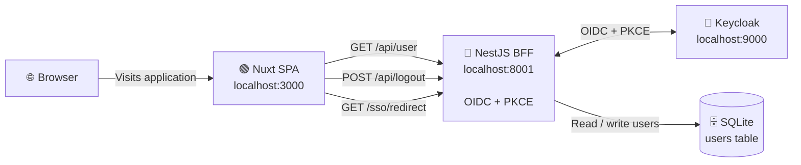

================================================================================
BAKERY API — NestJS + Keycloak (OIDC BFF)
================================================================================

A secure NestJS API that acts as both an OpenID Connect (OIDC) client and
Backend-for-Frontend (BFF) for a Nuxt 4 single-page application (SPA),
using Keycloak as the identity provider.

NestJS handles the entire OIDC authentication flow, including initiating
login, exchanging the OIDC authorization code for tokens, mapping the
external Keycloak identity to a local user, and creating and managing the
authenticated server-side session. The API also serves as the resource
server for the Nuxt frontend.

The Nuxt SPA never communicates directly with Keycloak and never receives,
stores, or processes OIDC access tokens, ID tokens, or refresh tokens. It
stores no authentication secrets and has no responsibility for the OIDC
flow. Instead, it communicates exclusively with the NestJS BFF and can
call endpoints such as /api/user to retrieve the currently authenticated
user. NestJS returns the authenticated user when a valid server-side
session exists, or 401 Unauthorized when the user is not authenticated.

This architecture keeps all OIDC tokens and authentication logic on the
server while providing the Nuxt SPA with a simple, secure session-based
authentication interface.

================================================================================
ARCHITECTURE
================================================================================



================================================================================
AUTHENTICATION FLOW
================================================================================

The user starts login from the Nuxt SPA.

The browser is redirected to NestJS's /sso/redirect endpoint.

NestJS generates a PKCE code verifier and code challenge, stores the
verifier in the session, builds the Keycloak authorization URL, and
redirects the browser to Keycloak.

Keycloak authenticates the user and redirects the browser back to NestJS
at /sso/callback with an authorization code.

NestJS verifies the state parameter, exchanges the authorization code
(plus the PKCE verifier) for tokens.

NestJS calls Keycloak's userinfo endpoint using the access token to fetch
the user's profile.

NestJS maps the OIDC issuer + subject to a local user via a Prisma upsert
(the equivalent of Laravel's updateOrCreate).

NestJS stores the local user in the express-session session.

The browser is redirected back to the Nuxt SPA dashboard.

The SPA calls /api/user using the session cookie.

NestJS resolves and returns the authenticated user.

================================================================================
SECURITY MODEL
================================================================================

Keycloak owns authentication and passwords.

NestJS owns the application session and authorization.

OIDC tokens remain server-side.

The browser never receives the client secret.

The SPA does not authenticate users itself.

Session-based authentication is handled by express-session with an
HttpOnly cookie and a custom SessionGuard.

PKCE (S256) is always used during the authorization code exchange.

Federated logout terminates both the NestJS and Keycloak sessions.

================================================================================
TECH STACK
================================================================================

Backend:        NestJS 11, TypeScript, Express (via @nestjs/platform-express)
Identity:       Keycloak, OpenID Connect, OAuth 2.0, PKCE (S256)
OIDC library:   openid-client v6
Database:       SQLite via Prisma 6 and @prisma/adapter-better-sqlite3
Sessions:       express-session (with passport for session plumbing)
Frontend:       Nuxt 4
Architecture:   Backend-for-Frontend (BFF), server-side sessions

================================================================================
TABLE OF CONTENTS
================================================================================

  1. What This Project Does
  2. Architecture
  3. Requirements
  4. Setup Steps
  5. Directory Structure
  6. Configuration Reference
  7. Key Files (Full Source)
  8. Routes
  9. Testing the API
 10. Common Errors and Fixes
 11. Production Migration Checklist
 12. Security Notes
 13. Related Projects
 14. Author

================================================================================
1. WHAT THIS PROJECT DOES
================================================================================

- Implements OIDC login against Keycloak as a confidential client
- Handles PKCE (S256) generation and verification
- Receives the authorization code at /sso/callback, exchanges it for tokens
- Fetches the userinfo endpoint and maps the OIDC identity (issuer +
  subject) to a local user record via Prisma
- Creates its own server-side session (cookie) after login
- Shares that session with the Nuxt SPA running on a different port
- Exposes /api/user and /api/logout behind a SessionGuard
- Builds the Keycloak federated logout URL on logout
- Returns 401 for unauthenticated requests, 403 for unauthorized ones

The Nuxt frontend is a thin client: it renders pages and calls the API. It
never talks to Keycloak, never handles tokens, never stores secrets.

================================================================================
2. ARCHITECTURE
================================================================================

Two independent sessions exist:

  1. Keycloak's SSO session (cookie on localhost:9000)
     Owned by Keycloak. Determines whether the user is already logged in.

  2. NestJS's session (cookie on localhost, shared with the SPA)
     Owned by this API. Determines whether the app recognizes the user.

The two are independent. Clearing one does not clear the other.
Federated logout clears both.

Flow diagram:

    ```mermaid
flowchart TD
    Browser["🌐 Browser"]

    Nuxt["🟢 Nuxt SPA<br/>localhost:3000"]

    Nest["🔵 NestJS BFF<br/>localhost:8001"]

    Keycloak["🔐 Keycloak<br/>localhost:9000"]

    SQLite[("🗄️ SQLite Database<br/>users table")]

    Browser -->|Loads application| Nuxt

    Nuxt -->|GET /api/user<br/>Session Cookie| Nest
    Nuxt -->|POST /api/logout<br/>Session Cookie| Nest
    Nuxt -->|GET /sso/redirect<br/>Browser Navigation| Nest

    Nest -->|OIDC Authorization Code + PKCE| Keycloak

    Keycloak -->|User / Identity Data| Nest

    Nest -->|Read / Write Users| SQLite
```

================================================================================
3. REQUIREMENTS
================================================================================

- Node.js 20 or newer
- npm
- SQLite (default) — no separate server process required
- Keycloak running on http://localhost:9000
  with realm "myapp" and a confidential client "nuxt-nestjs-bakery"
- curl for testing endpoints

Check your Node version:

    node -v

================================================================================
4. SETUP STEPS
================================================================================

4.1  Create the NestJS project

    npm i -g @nestjs/cli
    nest new bakery-api-nestjs --strict
    cd bakery-api-nestjs

4.2  Install authentication and database dependencies

    npm install @nestjs/config @nestjs/passport passport openid-client \
                express-session
    npm install prisma @prisma/client @prisma/adapter-better-sqlite3 \
                better-sqlite3
    npm install -D @types/passport @types/express-session

    Note: better-sqlite3 is REQUIRED. The Prisma SQLite adapter is only a
    wrapper; the actual SQLite driver must be installed separately.

4.3  Set up SQLite via Prisma

    npx prisma init --datasource-provider sqlite

    Create the database directory:

        mkdir -p database

    Edit prisma/schema.prisma to add the User model. Full contents are
    in Section 7.

4.4  Configure .env

    Full values are in Section 6.

4.5  Run the initial migration

    npx prisma migrate dev --name init

    This creates database/database.sqlite and generates the Prisma Client.

4.6  Create the Prisma service

    src/prisma.service.ts. Full contents are in Section 7.

4.7  Create the OIDC service

    src/auth/oidc.service.ts. Full contents are in Section 7.

4.8  Create the session guard

    src/auth/session.guard.ts. Full contents are in Section 7.

4.9  Create the auth controller

    src/auth/auth.controller.ts. Full contents are in Section 7.

4.10 Create the auth module

    src/auth/auth.module.ts. Full contents are in Section 7.

4.11 Update app.module.ts and main.ts

    Full contents are in Section 7.

4.12 Start the server

    npm run start:dev

    NestJS listens on http://localhost:8001.

4.13 Ensure Keycloak and Nuxt are running

    In separate terminals:

        cd ~/keycloak/keycloak-26.x.x && bin/kc.sh start-dev --http-port=9000
        cd ../bakery-spa && npm run dev

================================================================================
5. DIRECTORY STRUCTURE
================================================================================

    bakery-api-nestjs/
      .env
      database/
        database.sqlite                The SQLite database file
      prisma/
        schema.prisma                  User model definition
        migrations/
          20260921084540_init/
            migration.sql
      src/
        main.ts                        Bootstrap: session, CORS, prefix
        app.module.ts                  Root module
        prisma.service.ts              Prisma wrapper
        auth/
          auth.module.ts               Wires everything together
          auth.controller.ts           SSO + API endpoints
          oidc.service.ts              OIDC discovery + Configuration
          session.guard.ts             Session authentication guard
      package.json
      tsconfig.json
      nest-cli.json

================================================================================
6. CONFIGURATION REFERENCE
================================================================================

6.1  .env — Full configuration

    # Runtime environment
    NODE_ENV=development

    # Database — Prisma + SQLite
    # IMPORTANT: Use an ABSOLUTE path. Prisma Migrate resolves relative
    # paths against prisma/schema.prisma, but better-sqlite3 resolves them
    # against process.cwd(). A relative path works for migrations but
    # crashes the running app.
    DATABASE_URL="file:/absolute/path/to/bakery-api-nestjs/database/database.sqlite"

    # Server
    PORT=8001
    APP_URL=http://localhost:8001
    FRONTEND_URL=http://localhost:3000

    # Keycloak / OIDC
    OIDC_ISSUER_URL=http://localhost:9000/realms/myapp
    OIDC_CLIENT_ID=nuxt-nestjs-bakery
    OIDC_CLIENT_SECRET=<paste-secret-from-keycloak>
    OIDC_REDIRECT_URI=http://localhost:8001/sso/callback

    # Session
    SESSION_SECRET=<a-long-random-string>
    SESSION_DOMAIN=localhost
    SESSION_SECURE_COOKIE=false

6.2  Why each value matters

    DATABASE_URL (absolute path)
      Prisma Migrate and the runtime driver (better-sqlite3) resolve
      relative paths differently. Using an absolute path removes the
      ambiguity. See Common Errors 10.1.

    NODE_ENV
      Controls the OIDC "insecure HTTP" escape hatch. When this is not
      "production", OidcService allows HTTP issuers (needed for local
      Keycloak). In production, HTTPS is enforced by openid-client.

    SESSION_DOMAIN=localhost
      Allows the session cookie to be shared between localhost:3000 (SPA)
      and localhost:8001 (API). Without this, the SPA cannot send the
      cookie to the API.

    FRONTEND_URL
      Used for CORS and for the post-login redirect back to Nuxt. Must
      match the origin Nuxt is actually served from.

    SESSION_SECURE_COOKIE=false
      Keep this false during development. Set to true in production
      (requires HTTPS).

6.3  Ports

    Keycloak    http://localhost:9000
    NestJS      http://localhost:8001
    Nuxt        http://localhost:3000

    Use localhost consistently (not 127.0.0.1). Cookie domains must match
    between the SPA origin and the API origin.

================================================================================
7. KEY FILES (FULL SOURCE)
================================================================================

--------------------------------------------------------------------------------
7.1  prisma/schema.prisma
--------------------------------------------------------------------------------

generator client {
  provider = "prisma-client-js"
}

datasource db {
  provider = "sqlite"
  url      = env("DATABASE_URL")
}

model User {
  id          Int      @id @default(autoincrement())
  oidcIssuer  String?
  oidcSubject String?
  name        String
  email       String?
  createdAt   DateTime @default(now())
  updatedAt   DateTime @updatedAt

  @@unique([oidcIssuer, oidcSubject])
}

Note: There is NO password field. In a BFF setup, NestJS never stores
passwords. Keycloak owns authentication.

--------------------------------------------------------------------------------
7.2  src/prisma.service.ts
--------------------------------------------------------------------------------

import { Injectable, OnModuleInit, OnModuleDestroy } from '@nestjs/common';
import { PrismaClient } from '@prisma/client';
import { PrismaBetterSqlite3 } from '@prisma/adapter-better-sqlite3';

@Injectable()
export class PrismaService
  extends PrismaClient
  implements OnModuleInit, OnModuleDestroy
{
  constructor() {
    const adapter = new PrismaBetterSqlite3({
      url: process.env.DATABASE_URL,
    });
    super({ adapter });
  }

  async onModuleInit() {
    await this.$connect();
  }

  async onModuleDestroy() {
    await this.$disconnect();
  }
}

--------------------------------------------------------------------------------
7.3  src/auth/oidc.service.ts
--------------------------------------------------------------------------------

Note: The version below is the condensed reference implementation.
Your local file may contain additional inline comments for clarity.
The runtime behavior is identical.

import { Injectable, OnModuleInit } from '@nestjs/common';
import { ConfigService } from '@nestjs/config';
import * as client from 'openid-client';

@Injectable()
export class OidcService implements OnModuleInit {
  // Private backing field. The leading underscore avoids a name clash
  // with the public `configuration` getter below.
  private _configuration!: client.Configuration;

  constructor(private readonly configService: ConfigService) {}

  async onModuleInit() {
    const issuerUrl = this.configService.get<string>('OIDC_ISSUER_URL');
    const clientId = this.configService.get<string>('OIDC_CLIENT_ID');
    const clientSecret = this.configService.get<string>('OIDC_CLIENT_SECRET');
    const nodeEnv = this.configService.get<string>('NODE_ENV');

    if (!issuerUrl || !clientId || !clientSecret) {
      throw new Error(
        'OIDC_ISSUER_URL, OIDC_CLIENT_ID, and OIDC_CLIENT_SECRET must be set in .env',
      );
    }

    const isDevelopment = nodeEnv !== 'production';

    this._configuration = await client.discovery(
      new URL(issuerUrl),
      clientId,
      clientSecret,
      undefined,
      isDevelopment
        ? { execute: [client.allowInsecureRequests] }
        : undefined,
    );
  }

  // Public accessor. Controllers call `this.oidc.configuration`.
  get configuration(): client.Configuration {
    return this._configuration;
  }

  // Convenience accessor for the logout handler.
  get endSessionEndpoint(): string | undefined {
    return this._configuration.serverMetadata().end_session_endpoint;
  }
}

--------------------------------------------------------------------------------
7.4  src/auth/session.guard.ts
--------------------------------------------------------------------------------

import {
  CanActivate,
  ExecutionContext,
  Injectable,
  UnauthorizedException,
} from '@nestjs/common';
import type { Request } from 'express';

@Injectable()
export class SessionGuard implements CanActivate {
  canActivate(context: ExecutionContext): boolean {
    const req = context.switchToHttp().getRequest<Request>();
    const user = (req.session as any)?.user;

    if (!user) {
      throw new UnauthorizedException();
    }

    (req as any).user = user;
    return true;
  }
}

--------------------------------------------------------------------------------
7.5  src/auth/auth.controller.ts
--------------------------------------------------------------------------------

import {
  Controller,
  Get,
  Post,
  Req,
  Res,
  UseGuards,
} from '@nestjs/common';
import { ConfigService } from '@nestjs/config';
import type { Request, Response } from 'express';
import * as client from 'openid-client';

import { OidcService } from './oidc.service';
import { PrismaService } from '../prisma.service';
import { SessionGuard } from './session.guard';

@Controller('sso')
export class SsoController {
  constructor(
    private readonly oidc: OidcService,
    private readonly prisma: PrismaService,
    private readonly config: ConfigService,
  ) {}

  @Get('redirect')
  async redirect(@Req() req: Request, @Res() res: Response) {
    const config = this.oidc.configuration;

    const codeVerifier = client.randomPKCECodeVerifier();
    const codeChallenge = await client.calculatePKCECodeChallenge(codeVerifier);

    const state = client.randomState();
    (req.session as any).oidc = { codeVerifier, state };

    const authUrl = client.buildAuthorizationUrl(config, {
      redirect_uri: this.config.get<string>('OIDC_REDIRECT_URI')!,
      scope: 'openid profile email',
      code_challenge: codeChallenge,
      code_challenge_method: 'S256',
      state,
    });

    res.redirect(authUrl.href);
  }

  @Get('callback')
  async callback(@Req() req: Request, @Res() res: Response) {
    const config = this.oidc.configuration;
    const stored = (req.session as any).oidc;

    if (!stored) {
      return res.redirect(
        `${this.config.get('FRONTEND_URL')}/login?error=auth_failed`,
      );
    }

    try {
      const currentUrl = new URL(
        req.originalUrl,
        this.config.get<string>('APP_URL')!,
      );

      const tokens = await client.authorizationCodeGrant(config, currentUrl, {
        pkceCodeVerifier: stored.codeVerifier,
        expectedState: stored.state,
      });

      const userinfo = await client.fetchUserInfo(
        config,
        tokens.access_token,
        tokens.claims()?.sub!,
      );

      const issuer = this.config.get<string>('OIDC_ISSUER_URL')!;
      const subject = userinfo.sub;

      const user = await this.prisma.user.upsert({
        where: {
          oidcIssuer_oidcSubject: {
            oidcIssuer: issuer,
            oidcSubject: subject,
          },
        },
        update: {
          name: (userinfo.name as string) || 'OIDC User',
          email: (userinfo.email as string) || null,
        },
        create: {
          oidcIssuer: issuer,
          oidcSubject: subject,
          name: (userinfo.name as string) || 'OIDC User',
          email: (userinfo.email as string) || null,
        },
      });

      (req.session as any).user = {
        id: user.id,
        name: user.name,
        email: user.email,
        oidc_issuer: user.oidcIssuer,
        oidc_subject: user.oidcSubject,
      };

      delete (req.session as any).oidc;

      return res.redirect(`${this.config.get('FRONTEND_URL')}/dashboard`);
    } catch (err) {
      console.error('OIDC callback failed:', err);
      return res.redirect(
        `${this.config.get('FRONTEND_URL')}/login?error=auth_failed`,
      );
    }
  }
}

@Controller()
export class ApiController {
  constructor(
    private readonly oidc: OidcService,
    private readonly config: ConfigService,
  ) {}

  @Get('user')
  @UseGuards(SessionGuard)
  async user(@Req() req: Request) {
    return (req as any).user;
  }

  @Post('logout')
  @UseGuards(SessionGuard)
  async logout(@Req() req: Request, @Res() res: Response) {
    const clientId = this.config.get<string>('OIDC_CLIENT_ID')!;
    const frontendUrl = this.config.get<string>('FRONTEND_URL')!;

    req.session.destroy((err) => {
      if (err) {
        return res.status(500).json({ message: 'Session destruction error' });
      }

      // Reuse the already-discovered configuration. Do NOT call
      // client.discovery() again here — that would require re-applying
      // the `allowInsecureRequests` escape hatch and risks HTTPS errors.
      let logoutUrl: string | null = null;
      const endSession = this.oidc.endSessionEndpoint;

      if (endSession) {
        const url = new URL(endSession);
        url.searchParams.set('post_logout_redirect_uri', frontendUrl);
        url.searchParams.set('client_id', clientId);
        logoutUrl = url.href;
      }

      return res.json({
        message: 'Logged out',
        logout_url: logoutUrl,
      });
    });
  }
}

--------------------------------------------------------------------------------
7.6  src/auth/auth.module.ts
--------------------------------------------------------------------------------

import { Module } from '@nestjs/common';
import { PassportModule } from '@nestjs/passport';
import { SsoController, ApiController } from './auth.controller';
import { OidcService } from './oidc.service';
import { SessionGuard } from './session.guard';
import { PrismaService } from '../prisma.service';

@Module({
  imports: [PassportModule],
  controllers: [SsoController, ApiController],
  providers: [OidcService, SessionGuard, PrismaService],
  exports: [PrismaService],
})
export class AuthModule {}

--------------------------------------------------------------------------------
7.7  src/app.module.ts
--------------------------------------------------------------------------------

import { Module } from '@nestjs/common';
import { ConfigModule } from '@nestjs/config';
import { AuthModule } from './auth/auth.module';

@Module({
  imports: [
    ConfigModule.forRoot({ isGlobal: true }),
    AuthModule,
  ],
})
export class AppModule {}

--------------------------------------------------------------------------------
7.8  src/main.ts
--------------------------------------------------------------------------------

import { NestFactory } from '@nestjs/core';
import { ConfigService } from '@nestjs/config';
import session from 'express-session';
import passport from 'passport';

import { AppModule } from './app.module';

async function bootstrap() {
  const app = await NestFactory.create(AppModule);
  const config = app.get(ConfigService);

  app.enableCors({
    origin: config.get<string>('FRONTEND_URL'),
    credentials: true,
  });

  app.use(
    session({
      secret: config.get<string>('SESSION_SECRET')!,
      resave: false,
      saveUninitialized: false,
      cookie: {
        httpOnly: true,
        secure: config.get('SESSION_SECURE_COOKIE') === 'true',
        sameSite: 'lax',
        domain: config.get<string>('SESSION_DOMAIN'),
        maxAge: 1000 * 60 * 60 * 24,
      },
    }),
  );

  app.use(passport.initialize());
  app.use(passport.session());

  app.setGlobalPrefix('api', {
    exclude: ['sso/redirect', 'sso/callback'],
  });

  const port = config.get<number>('PORT') || 8001;
  await app.listen(port);
  console.log(`BFF running on http://localhost:${port}`);
}

bootstrap();

================================================================================
8. ROUTES
================================================================================

  Method   Path              Guard            Purpose
  ----------------------------------------------------------------------------
  GET      /sso/redirect     —                Starts the OIDC flow
  GET      /sso/callback     —                Handles Keycloak's redirect
  GET      /api/user         SessionGuard     Returns the current user
  POST     /api/logout       SessionGuard     Ends session + builds logout URL

Verify the routes exist by checking the Nest startup logs:

    [RoutesResolver] SsoController {/sso}
    [RouterExplorer] Mapped {/sso/redirect, GET} route
    [RouterExplorer] Mapped {/sso/callback, GET} route
    [RoutesResolver] ApiController {/api}
    [RouterExplorer] Mapped {/api/user, GET} route
    [RouterExplorer] Mapped {/api/logout, POST} route

================================================================================
9. TESTING THE API
================================================================================

9.1  Verify NestJS is running

    curl -sI http://localhost:8001/sso/redirect | head -5

    Should return:

      HTTP/1.1 302 Found
      Location: http://localhost:9000/realms/myapp/protocol/openid-connect/auth?...

    If you see the Location header pointing to Keycloak, the OIDC client
    is configured correctly.

9.2  Verify unauthenticated requests return 401

    curl -s -o /dev/null -w "%{http_code}\n" http://localhost:8001/api/user

    Expected: 401

9.3  Verify the database schema

    npx prisma studio

    Opens a browser UI where you can inspect the User table.

    From the CLI:

    sqlite3 database/database.sqlite ".schema users"

    The User table should NOT have a password column.

9.4  Verify the discovery document is reachable

    curl -s http://localhost:9000/realms/myapp/.well-known/openid-configuration \
      | python3 -m json.tool | grep end_session

    Expected:

      "end_session_endpoint": "http://localhost:9000/realms/myapp/protocol/openid-connect/logout"

================================================================================
10. COMMON ERRORS AND FIXES
================================================================================

10.1  TypeError: Cannot open database because the directory does not exist

Cause:
  Prisma Migrate resolves relative SQLite paths against
  prisma/schema.prisma, but the runtime driver (better-sqlite3) resolves
  them against process.cwd() (the project root). A relative path works
  for migrations but crashes the running app.

Fix:
  Use an absolute path in .env:

    DATABASE_URL="file:/absolute/path/to/bakery-api-nestjs/database/database.sqlite"

  Also make sure the database/ directory exists:

    mkdir -p database

10.2  TypeError: session is not a function

Cause:
  express-session is a CommonJS module. With esModuleInterop enabled,
  "import * as session" produces a namespace object that isn't callable.

Fix:
  Use a default import in main.ts:

    import session from 'express-session';

10.3  TypeError: passport.initialize is not a function

Cause:
  Same as 10.2 — passport is a CommonJS module.

Fix:
  Use a default import in main.ts:

    import passport from 'passport';

10.4  TS1272: A type referenced in a decorated signature must be imported
      with 'import type'

Cause:
  NestJS 11 enables both isolatedModules and emitDecoratorMetadata. Any
  type used in a decorated method signature (like @Req() req: Request)
  must be imported as a type-only import.

Fix:
  Change the import in the affected file:

    import type { Request, Response } from 'express';

10.5  ClientError: only requests to HTTPS are allowed

Cause:
  openid-client v6 refuses HTTP issuer URLs by default. Local Keycloak
  runs on HTTP.

Fix:
  In OidcService.onModuleInit, pass allowInsecureRequests only in
  development:

    const isDevelopment = nodeEnv !== 'production';

    this._configuration = await client.discovery(
      new URL(issuerUrl),
      clientId,
      clientSecret,
      undefined,
      isDevelopment
        ? { execute: [client.allowInsecureRequests] }
        : undefined,
    );

  Also make sure the logout handler reuses the discovered configuration
  via `this.oidc.endSessionEndpoint` and does NOT call
  client.discovery() a second time.

10.6  The "class-validator" package is missing

Cause:
  The ValidationPipe from @nestjs/common requires class-validator and
  class-transformer as peer dependencies.

Fix:
  Either install the packages:

    npm install class-validator class-transformer

  Or remove the ValidationPipe from main.ts if you don't yet use DTOs.

10.7  404 Not Found on /sso/redirect

Cause:
  The global prefix 'api' was applied to every route, so the effective
  URL was /api/sso/redirect instead of /sso/redirect.

Fix:
  In main.ts, exclude the SSO routes from the global prefix:

    app.setGlobalPrefix('api', {
      exclude: ['sso/redirect', 'sso/callback'],
    });

10.8  CORS error: Access-Control-Allow-Origin header has a value that is
      not equal to the supplied origin

Cause:
  Nuxt is running on a different port than FRONTEND_URL specifies.
  Nuxt auto-falls back to 3001 if 3000 is busy, but FRONTEND_URL is
  still set to http://localhost:3000.

Fix:
  Either free up port 3000 (lsof -i :3000, then kill the process), or
  set FRONTEND_URL to match the actual Nuxt origin:

    FRONTEND_URL=http://localhost:3001

  Remember to also update Keycloak's "Valid post logout redirect URIs"
  to match.

10.9  Invalid parameter: redirect_uri

Cause:
  The redirect URI sent by NestJS does not exactly match what is
  registered in Keycloak. "127.0.0.1" and "localhost" are treated as
  different strings.

Fix:
  Standardize on "localhost". In .env:

    OIDC_REDIRECT_URI=http://localhost:8001/sso/callback

  And register the same value in Keycloak's "Valid redirect URIs".

10.10 Invalid redirect uri (on logout)

Cause:
  The post_logout_redirect_uri sent by NestJS does not exactly match
  what is registered in Keycloak. A trailing slash makes them different
  strings.

Fix:
  In Keycloak -> Clients -> nuxt-nestjs-bakery -> Settings ->
  Valid post logout redirect URIs, ensure the entry matches FRONTEND_URL
  in .env exactly (no trailing slash).

10.11 Duplicate identifier 'configuration'

Cause:
  A class cannot have both a private field and a getter with the same
  name. TypeScript treats them as colliding members.

Fix:
  Rename the private backing field to `_configuration` and keep the
  public getter named `configuration`:

    private _configuration!: client.Configuration;

    get configuration(): client.Configuration {
      return this._configuration;
    }

================================================================================
11. PRODUCTION MIGRATION CHECKLIST
================================================================================

When moving this API from local development to production, only the
following values change. No source code changes are required.

11.1  .env diff

  Variable                      Local                              Production
  ------------------------------------------------------------------------------
  NODE_ENV                      development                        production
  PORT                          8001                               8000 (or as needed)
  APP_URL                       http://localhost:8001              https://api.company.com
  FRONTEND_URL                  http://localhost:3000              https://app.company.com
  OIDC_ISSUER_URL               http://localhost:9000/realms/myapp https://login.company.com/realms/myapp
  OIDC_CLIENT_ID                nuxt-nestjs-bakery                 <production-client-id>
  OIDC_CLIENT_SECRET            <local-secret>                     <production-secret>
  OIDC_REDIRECT_URI             http://localhost:8001/sso/callback https://api.company.com/sso/callback
  SESSION_DOMAIN                localhost                          .company.com
  SESSION_SECURE_COOKIE         false                              true
  DATABASE_URL                  SQLite file                        PostgreSQL/MySQL connection string

11.2  Additional production changes

  - Switch Prisma from SQLite to PostgreSQL. Update schema.prisma:

      datasource db {
        provider = "postgresql"
        url      = env("DATABASE_URL")
      }

    Remove the @prisma/adapter-better-sqlite3 and better-sqlite3
    packages, and remove the adapter from PrismaService.

  - Trust your reverse proxy. If behind nginx or a load balancer, add:

      app.set('trust proxy', 1);

    to main.ts before the session middleware.

  - Force HTTPS. Set SESSION_SECURE_COOKIE=true and ensure the reverse
    proxy terminates TLS.

  - Use a persistent session store. The default express-session
    MemoryStore is not suitable for production. Use connect-pg-simple
    (PostgreSQL) or a Redis store:

      npm install connect-pg-simple
      # or
      npm install connect-redis ioredis

  - Set session timeouts deliberately. The maxAge on the session cookie
    should be coordinated with the Keycloak-side session timeout
    (Realm settings -> Sessions).

  - Back up both databases. NestJS's and Keycloak's.

11.3  What does NOT change

  - src/auth/auth.controller.ts
  - src/auth/oidc.service.ts
  - src/auth/session.guard.ts
  - The user mapping logic (oidcIssuer + oidcSubject)
  - The 401 / 403 distinction
  - The middleware registration

The architecture is production-shaped. Only the values change.

================================================================================
12. SECURITY NOTES
================================================================================

Rule 1 — Keycloak owns authentication

  NestJS never stores passwords, never sees passwords, and never
  validates passwords. All of that belongs to Keycloak.

Rule 2 — NestJS owns authorization

  Roles, permissions, and business data belong to this API. They are
  the reason a local user table exists.

Rule 3 — Decode is not validate

  If NestJS receives a JWT, decoding it does not prove authenticity.
  Signature verification via the IdP's JWKS is required. openid-client
  handles this automatically through its discovery and JWKS caching.

Rule 4 — 401 vs 403

  401 Unauthorized = "We cannot establish who you are."
  403 Forbidden    = "We know who you are. You are not allowed to do this."

  A 403 after a successful SSO login is not a bug. It means
  authentication worked and the authorization layer did its job.

Rule 5 — Do not trust the frontend

  The Nuxt SPA does not tell NestJS who the user is. It sends a
  session cookie. NestJS independently resolves the user from that.

Rule 6 — Keep the client secret secret

  The OIDC_CLIENT_SECRET must live only in the API's .env. Never ship
  it to the browser. Never commit it to version control.

Rule 7 — Session cookies must be HttpOnly and Secure

  In production, SESSION_SECURE_COOKIE=true and the session cookie is
  HttpOnly. Together these prevent JavaScript access and require HTTPS.

Rule 8 — PKCE is mandatory

  openid-client v6 always uses PKCE (S256). The code verifier is stored
  in the session between /sso/redirect and /sso/callback. Never
  downgrade to the plain code flow.

Rule 9 — Discover once, reuse everywhere

  OidcService performs discovery a single time at startup. Every other
  part of the app (including the logout handler) reads from the cached
  Configuration. Never call client.discovery() again at request time —
  each call would need its own `allowInsecureRequests` escape hatch and
  is easy to get wrong.

================================================================================
13. RELATED PROJECTS
================================================================================

  bakery-spa      Nuxt 4 SPA that consumes this API.
                  Delegates all authentication. Never handles tokens.
                  See its README for full frontend setup.

  Keycloak        The Identity Provider. Realm "myapp", confidential
                  client "nuxt-nestjs-bakery". See the project
                  documentation for the Keycloak setup.

================================================================================
14. AUTHOR
================================================================================

This project was developed by **Tochukwu Uchem**.

- Github:   https://github.com/uchemcolin
- Linkedin: https://www.linkedin.com/in/tochukwu-uchem-802888144/
- Gitlab:   https://gitlab.com/uchemcolin

================================================================================
END OF DOCUMENT
================================================================================